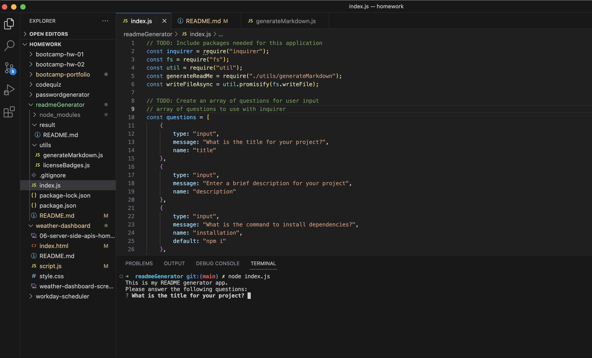

# readmeGenerator
Bootcamp Homework 7: Professional README Generator

## Node.js Challenge: Professional README Generator
In this project, we were asked to build a README file generator where a user answers a series of questions that will then render in the file that is auto generated by this app. The main task is to create a command-line application that dynamically generates a professional README.md file from a user's input using the Inquirer package. In my application, the auto generated README.md file will be created under the "result" folder. 

## How to Use this App:
To run the application, the steps are:
1. Run node index.js in your terminal
2. Answer all the questions
3. The README.md file will be generated under the result folder

## References/Resources

I mostly referred to our recent lessons/activities for this assignment. 

## URLs submitted
* My Repo URL: https://github.com/lenzlee/readmeGenerator
* Application URL: https://lenzlee.github.io/readmeGenerator/
* Video Demo: https://youtu.be/0QcpFiqfMqY 

## My Application Screenshot

## Link to Demo Video
https://youtu.be/0QcpFiqfMqY 

